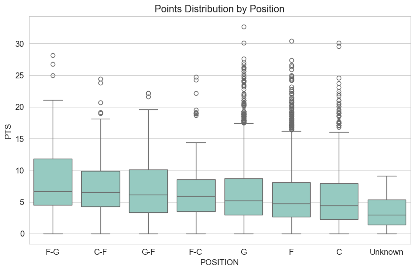

# NBA Player Insights: An Exploratory Data Analysis & Predictive Modeling

## Project Overview

This project performs an exploratory data analysis (EDA) and predictive modeling on a dataset of NBA player statistics. The goal is to uncover insights related to player performance, the impact of draft position, physical attributes, geographical diversity, and college origins. Additionally, a machine learning model is developed to predict career points per game based on pre-NBA characteristics. The analysis utilizes Python (Pandas, Matplotlib, Seaborn, Scikit-learn) for data manipulation, visualization, and modeling, and also demonstrates SQL querying capabilities.

For a comprehensive overview of the project, please visit the detailed project page on my portfolio: ➡️ [Dean Bonsu - Mould Detection Project](https://DeanAnalyst.github.io/projects/mould-detection/) ⬅️

## Data Source

The dataset, `PlayerIndex_nba_stats.csv`, contains statistical information about current and former NBA players, sourced from official NBA statistics.

**Key Columns:**
- `PERSON_ID`, `PLAYER_LAST_NAME`, `PLAYER_FIRST_NAME`: Player identifiers
- `TEAM_ABBREVIATION`, `TEAM_NAME`: Team information
- `POSITION`: Player position (G, F, C, F-G, C-F)
- `HEIGHT`, `WEIGHT`: Physical attributes
- `COLLEGE`, `COUNTRY`: Origin information
- `DRAFT_YEAR`, `DRAFT_ROUND`, `DRAFT_NUMBER`: Draft details
- `PTS`, `REB`, `AST`: Key performance statistics (Points, Rebounds, Assists per game)
- `STATS_TIMEFRAME`: Indicates if stats are 'Career' or 'Season' (latest season for active players)
- `FROM_YEAR`, `TO_YEAR`: Years active in the NBA

## Technologies Used

- Python 3.x
- Pandas: For data manipulation and analysis.
- NumPy: For numerical operations.
- Matplotlib & Seaborn: For data visualization.
- `pandasql`: For running SQL queries on Pandas DataFrames.
- Scikit-learn: For machine learning (preprocessing, modeling, evaluation).
- Jupyter Notebook: For interactive analysis and presentation.
- (Potential for Power BI for advanced interactive dashboards)

## Project Structure

- `data/`: Contains the raw CSV dataset (`PlayerIndex_nba_stats.csv`).
- `notebooks/`: Houses the Jupyter Notebook (`nba_analysis.ipynb`) with the Python code for analysis, visualization, and predictive modeling.
- `visualizations/`: (Optional) Directory for saved static plot images.
- `README.md`: This file.
- `requirements.txt`: Lists Python dependencies.

## Setup and Usage

1.  **Clone the repository:**
    ```bash
    git clone <your-repo-link>
    cd nba-player-analysis
    ```
2.  **Create a virtual environment (recommended):**
    ```bash
    python -m venv venv
    source venv/bin/activate  # On Windows: venv\Scripts\activate
    ```
3.  **Install dependencies:**
    ```bash
    pip install -r requirements.txt
    ```
4.  **Launch Jupyter Notebook:**
    ```bash
    jupyter lab
    ```
    Then, open `notebooks/nba_analysis.ipynb`.

## Key Findings from Exploratory Data Analysis (EDA)

1.  **Player Performance Landscape:**
    *   Core statistics (Points, Rebounds, Assists per game) for career performance exhibit a right-skewed distribution, indicating that while most players have moderate outputs, a select group of elite players achieve exceptionally high statistics.
    *   There's a general positive correlation between these key performance indicators, suggesting that players proficient in one area often show strength in others.

2.  **Positional Differences:**
    *   Statistical outputs and physical attributes vary significantly by position:
        *   Guards (G) generally lead in average Assists.
        *   Centers (C) and Center-Forwards (C-F) typically lead in average Rebounds and are, on average, the tallest players.
        *   In this dataset, Forward-Guards (F-G) showed the highest average Points.
    *   Violin plots clearly visualized these differences in height and statistical distributions across positions.

3.  **The Draft's Impact:**
    *   Draft position is a notable indicator of future performance: players drafted earlier (a **lower draft number**) tend to have higher career average points. This was visualized using a scatter plot with a LOWESS trend line.
    *   First-round draftees, on average, score significantly more points per game throughout their careers compared to players drafted in later rounds (e.g., Round 1 average career PTS was ~8.7, while Round 2 was ~5.1).

4.  **College and International Pipelines:**
    *   Prominent NCAA programs like Kentucky, UCLA, Duke, and North Carolina are major contributors of NBA talent. Analysis of average career points for players from these top-producing colleges showed that alumni from institutions like Ohio State and North Carolina (among this top group) achieved high scoring averages.
    *   Internationally, Canada is the most represented non-USA country in the dataset, followed by nations like France and Serbia. Players from countries such as Spain and Croatia (from the top 10 international countries by player count) have demonstrated strong average career point outputs.

5.  **Physicality and Performance:**
    *   A clear positive correlation was observed between player height and rebounds per game, especially pronounced for frontcourt players.
    *   The relationship between weight and points per game is more complex and appears to be influenced by positional roles rather than a direct linear correlation.

6.  **Recent Season Highlights:**
    *   Analysis of the latest season data for active players identified top performers such as Shai Gilgeous-Alexander (Points), Domantas Sabonis (Rebounds), and Trae Young (Assists), among others.

## SQL Query Examples

The notebook also demonstrates querying the data using SQL syntax via `pandasql`, showcasing abilities such as:
- Selecting the top 10 players by career points.
- Calculating average points per game grouped by position.
- Filtering players based on college and performance metrics (e.g., Duke players with > 15 career PPG).
- Summarizing draft information by year.

## Predictive Modeling: Career Points Per Game (PTS)

A predictive modeling component was implemented to forecast a player's **Career Points Per Game (PTS)** using features available around their draft time or early physical measurements:
- **Features:** `DRAFT_NUMBER`, `DRAFT_ROUND`, `HEIGHT_INCHES`, `WEIGHT_LBS`, `POSITION`, `COLLEGE`.
- **Target Variable:** `PTS` (for players with `STATS_TIMEFRAME == 'Career'`).
- **Preprocessing:** Numerical features were imputed (median) and scaled (StandardScaler). Categorical features were imputed ('Unknown') and one-hot encoded.

**Models Tested & Performance (R-squared):**
- Linear Regression: R2 ≈ 0.075
- Ridge Regression: R2 ≈ 0.124
- **Random Forest Regressor: R2 ≈ 0.252 (RMSE: ≈3.99)**
- Gradient Boosting Regressor: R2 ≈ 0.248

**Key Findings from Modeling:**
- The Random Forest Regressor provided the best fit among the tested models, explaining approximately **25.2% of the variance** in career Points Per Game based on the selected features.
- **Feature Importance (Random Forest):**
    1.  `DRAFT_NUMBER` was overwhelmingly the most influential predictor, with the model associating earlier picks (**lower draft numbers**) with higher predicted career points.
    2.  `HEIGHT_INCHES` and `WEIGHT_LBS` also demonstrated notable importance.
    3.  `DRAFT_ROUND` contributed to the predictive power.
    4.  The general `POSITION_G` and specific colleges like `COLLEGE_Eastern Michigan` and `COLLEGE_North Carolina` appeared among the top 20 important features, though the impact of individual colleges is diffused due to the high number of unique college values.

**Limitations of the Predictive Model:**
- The model predicts *career average* PTS, which smooths out peak performance and career longevity.
- The `COLLEGE` feature's high cardinality was handled with basic one-hot encoding; more advanced techniques might refine its impact.
- Many unquantifiable factors (e.g., work ethic, injury luck, coaching, team system changes) critical to a player's career are not captured in the dataset.
- The definition of "performance" was limited to PTS; more holistic metrics (if available) could provide a different perspective.

## Selected Visualizations

*   **Average Points by Position:**
    
*   **Draft Pick vs. Career Points:**
    
*   **Top 10 Non-USA Countries by Player Count:**
    
*   **Feature Importances for Career PTS Prediction:**
    

## Power BI Dashboard Potential

The cleaned dataset from this analysis is well-suited for creating interactive dashboards in Power BI. Potential dashboard pages could include:
- **Player Profile Explorer:** Select a player to see their detailed stats, career trajectory, and comparisons to positional averages.
- **Draft Class Analysis:** Interactively compare draft classes, analyze success by draft position, and identify top performers or "steals."
- **Geospatial Player Origin Map:** Visualize player origins globally, with metrics like player count or average performance represented by bubble size or color intensity.
- **Positional Breakdown:** Dynamic charts and tables allowing users to compare detailed statistics across different player positions.
- **College/Country Leaderboards:** Interactive leaderboards for colleges and countries, filterable by various performance metrics or draft outcomes.
- **Predictive Insights (Conceptual):** A dashboard page allowing users to input hypothetical player attributes (draft pick, physicals, college) and see a model-based predicted career PTS range, along with key influencing factors for that prediction.

## Future Work

- **Incorporate Advanced Statistics:** Integrate metrics like Player Efficiency Rating (PER), Win Shares, Value Over Replacement Player (VORP) if available.
- **Analyze Career Arcs & Longevity:** Model player development trajectories and factors influencing career length.
- **Time-Series Analysis:** If season-by-season data becomes available, analyze how player stats and league trends have evolved.
- **Refine Predictive Models:** Experiment with more sophisticated feature engineering (e.g., for the `COLLEGE` feature), different algorithms, and hyperparameter tuning. Predict other outcomes like likelihood of becoming an All-Star.
- **Interactive Web Application:** Develop a small web app (e.g., using Streamlit or Dash) to allow users to interact with the data and possibly the predictive model.
